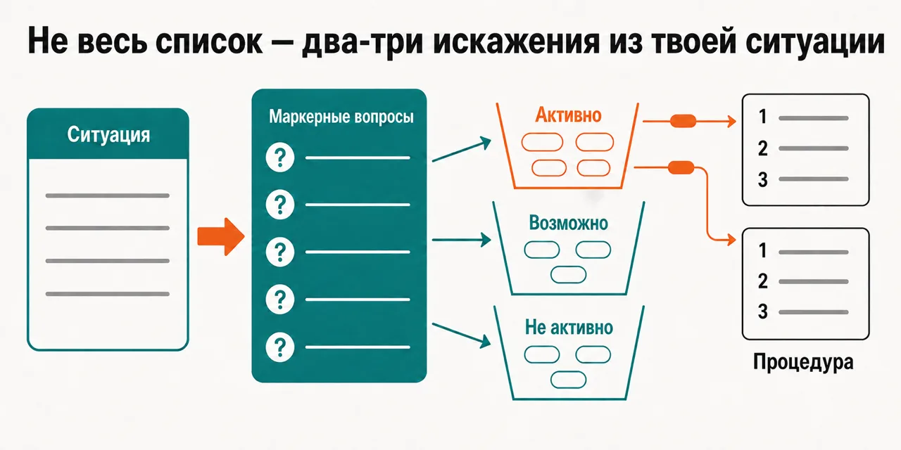
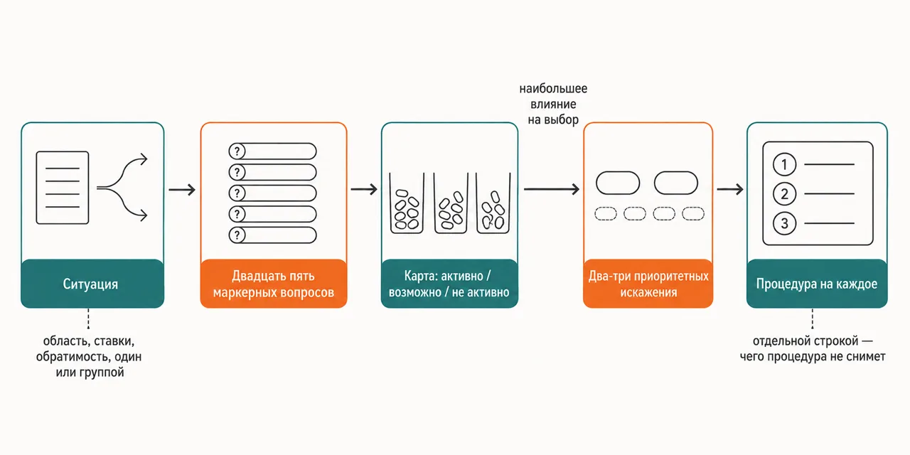

Русский · [English](README.en.md)

# Список искажений ты уже видел — он не говорит, какое из них работает в твоём решении прямо сейчас

Ты описываешь ситуацию словами, скан прогоняет её через двадцать пять маркерных вопросов,
оставляет два-три искажения с самыми сильными признаками и на каждое выдаёт процедуру:
кто что делает и в какой момент.

```
claude plugin marketplace add https://github.com/beCyborg/jadlis-start.git
claude plugin install cognitive-biases@jadlis
```

Ключей и подписок на сторонние сервисы здесь нет: единственная настройка — папка `MEMORY_DIR`,
куда советник кладёт свой профиль, и она необязательная — не задал, советник скажет об этом
и пойдёт дальше без памяти.



Текстом: слева описание решения обычными словами, справа три корзины — активно, возможно,
не активно, — и из верхней корзины наружу выходят два-три искажения с процедурой на каждое.

Это моё рабочее место, выложенное как есть, а не продукт: чем перестал пользоваться — убрал.

## Было → стало

| Руками | Чатом с ИИ | Этим плагином |
|---|---|---|
| **Как выбирается искажение.** Список открыт целиком, и по ощущению подходит почти всё. | Называется то, что чаще упоминают: невозвратные затраты, Даннинг-Крюгер, потери вдвое больнее выигрышей. | Двадцать пять маркерных вопросов проходят по твоей ситуации, и каждое искажение получает пометку: активно, возможно, не активно. |
| **Насколько крепка находка.** Картинка со ста искажениями ставит их все вровень. | Знаменитое звучит так же уверенно, как многократно перепроверенное. | Каждое искажение стоит на одном из пяти уровней — по размеру эффекта и по тому, воспроизводятся ли данные, — и уровень называется вместе с находкой. |
| **Что делать после названия.** Искажение названо, дальше остаётся «будь внимательнее». | Совет общего вида: учитывай это при решении. | На приоритетное искажение выдаётся процедура: механизм, шаги, поправка на твою область и ставки, и отдельной строкой — чего эта процедура не снимет. |
| **Знаменитые объяснения.** Про потери, Даннинга-Крюгера и переизбыток выбора ты слышал и принял как закон. | Пересказывается в исходной, самой громкой формулировке. | Шесть таких объяснений разобраны отдельным файлом: что утверждал оригинал, что показала перепроверка, чем пользоваться вместо. |
| **Сколько находок уносишь.** Отмечаешь у себя половину списка и не знаешь, с чего начать. | Ответ растёт вместе с вопросом. | Разбор ограничен двумя-тремя искажениями: если активным вышло всё, это считается провалом сортировки, а не богатым уловом. |

## Как это работает



На входе — твоя ситуация: область, ставки, обратимо ли решение, решаешь ты один или группой.
Внутри — двадцать пять маркерных вопросов сортируют искажения на активные, возможные и
неактивные, приоритет получают два-три с наибольшим влиянием на этот выбор.
На выходе — карта скана и процедура дебайсинга на каждое приоритетное искажение.

Текстом: ситуация → двадцать пять маркерных вопросов → карта «активно / возможно / не активно»
→ два-три приоритетных искажения → процедура на каждое.

Раскладывает советник материал по семи справочникам: два на первый уровень (оценка и планирование;
авторитет и группа), два на второй (рамка выбора; память и оценка задним числом), один на третий —
домен-специфичный, с финансами, наймом, групповой динамикой и решением задач. Отдельный файл держит
разобранные мифы, ещё один — десять техник дебайсинга: референс-класс, пре-мортем, взгляд с
противоположной стороны, адвокат дьявола, стилмен, независимая оценка, проспективный взгляд назад,
обезличивание, намерения-реализации, внешний оценщик. У каждой техники записано, против каких
искажений она работает, шаги и чего она не даёт.

Складывает советник контекст сессии в `{MEMORY_DIR}/Профили/adv-CognitiveBiases.md`: область,
ставки, найденные искажения и их статус, применённые техники. При следующем запуске файл читается
первым, и ты подтверждаешь, что контекст ещё в силе. За пределы папки памяти не пишется ничего.

## Установка и первый запуск

**а) Текст для вставки агенту.** Скопируй целиком в чат Claude Code:

```
Ты — установщик. Поставь на этот Mac плагин cognitive-biases из маркетплейса jadlis.
Выполни ровно эти команды, дословно, ничего не сокращая:
1. claude plugin marketplace add https://github.com/beCyborg/jadlis-start.git
2. claude plugin install cognitive-biases@jadlis
3. claude plugin list — покажи мне строку про cognitive-biases и его версию.
Ключей, подписок на сторонние сервисы и внешних CLI этому плагину не нужно — не ищи их
и не проси. Единственная настройка — папка памяти MEMORY_DIR: спроси у меня путь и
подставь его, сам не выдумывай; я могу и отказаться, тогда ставь без неё.
Перед каждой командой покажи её мне целиком и дождись «да». Сказал «нет» — не выполняй,
скажи, что именно пропустил, и иди дальше.
Команда вернула ошибку — остановись, покажи вывод, к следующей не переходи.
```

**б) Команды руками.**

```
claude plugin marketplace add https://github.com/beCyborg/jadlis-start.git
claude plugin install cognitive-biases@jadlis
claude plugin list
```

Первая команда ничего не ставит — она добавляет маркетплейс. Ставит только вторая, и снимается
она одной строкой: `claude plugin uninstall cognitive-biases@jadlis --keep-data`.

Папку памяти можно задать прямо в установке — `claude plugin install cognitive-biases@jadlis
--config MEMORY_DIR=~/advisors-memory`, — либо позже через `/plugin` → cognitive-biases →
settings. Все советы Jadlis можно направить в одну и ту же папку: скелет разворачивается
идемпотентно, существующие файлы не трогаются. Папка приватная — держи её вне публичных
репозиториев.

**в) Короткая команда.** Открой Claude Code в папке, где работаешь, и набери:

```
/cognitive-biases <решение или ситуация>
```

Не находится — сверь имя строкой `claude plugin list`. Запустишь без описания ситуации —
сортировать будет не по чему, и ответ выйдет общим: сначала опиши область, ставки, обратимость
и то, решаешь ты один или группой.

## Границы, стоимость, обновление

**Чего не делает.** Не созывает совет и не сводит вердикты нескольких линз — это
`/advisor-decision`. Внутри того совета есть линза с похожим именем, но собрана она из пяти книг
и это другое содержимое, а не этот же справочник. Не ходит в веб и не проверяет, не вышла ли
свежая перепроверка: числа и ссылки зашиты в файлы справочников и стареют вместе с ними. Не
проверяет утверждения перекрёстно. Не пишет вердикт файлом в папку совета — сохраняется только
профиль сессии. Не ставит диагноз и не заменяет специалиста: границы описаны в
`NOTICE.md`. И не принимает решение за тебя — скан говорит, где искать искажение,
а выбор остаётся твоим.

**Что нужно.** Ключей не нужно. MCP-серверов плагин не поднимает, внешних CLI и бинарников не
требует, зависимостей от других плагинов у него нет. Единственная настройка — необязательная
папка `MEMORY_DIR` на твоём диске; по умолчанию `~/advisors-memory`.

**Порядок расхода токенов.** Прогон лёгкий: один скилл в твоей сессии, без субагентов и без
параллельных линз — тяжёлые фан-ауты живут в советах, а не здесь. Дороже прочего обходится чтение
справочников, поэтому скилл берёт не все семь, а те, на которые указал навигационный маршрут по
твоей ситуации.

[уточнить] — ранжированного списка всех 111 искажений в файлах репозитория нет: справочники
раскрывают сорок восемь названных искажений, остальные стоят только числом в описании плагина.

**Проверено там, где я работаю:** мой Mac, моя подписка Claude Code. Где ещё это работает —
[уточнить].

**Условия использования.** Лицензии нет: все права сохранены за автором. Читать и
пользоваться лично можно. Коммерческое использование, переиздание и включение в свои
продукты — по договорённости со мной.

**Обновление.** У стороннего маркетплейса авто-обновление на твоей стороне выключено: пока не
запустишь первую команду, у тебя остаётся та версия, которую ты поставил.

```
claude plugin marketplace update jadlis
claude plugin update cognitive-biases@jadlis
claude plugin list
```

Переустановка, если что-то встало криво:

```
claude plugin uninstall cognitive-biases@jadlis --keep-data && claude plugin install cognitive-biases@jadlis
```

Репозиторий генерируется из приватного источника, прямая правка здесь падает на проверке хеша —
нашёл ошибку, заводи issue: правка ляжет в источник и приедет следующим релизом.
